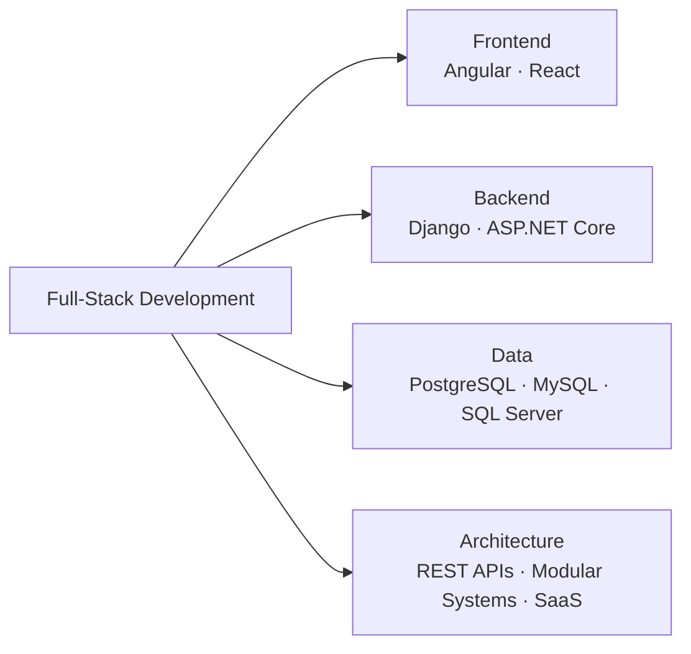
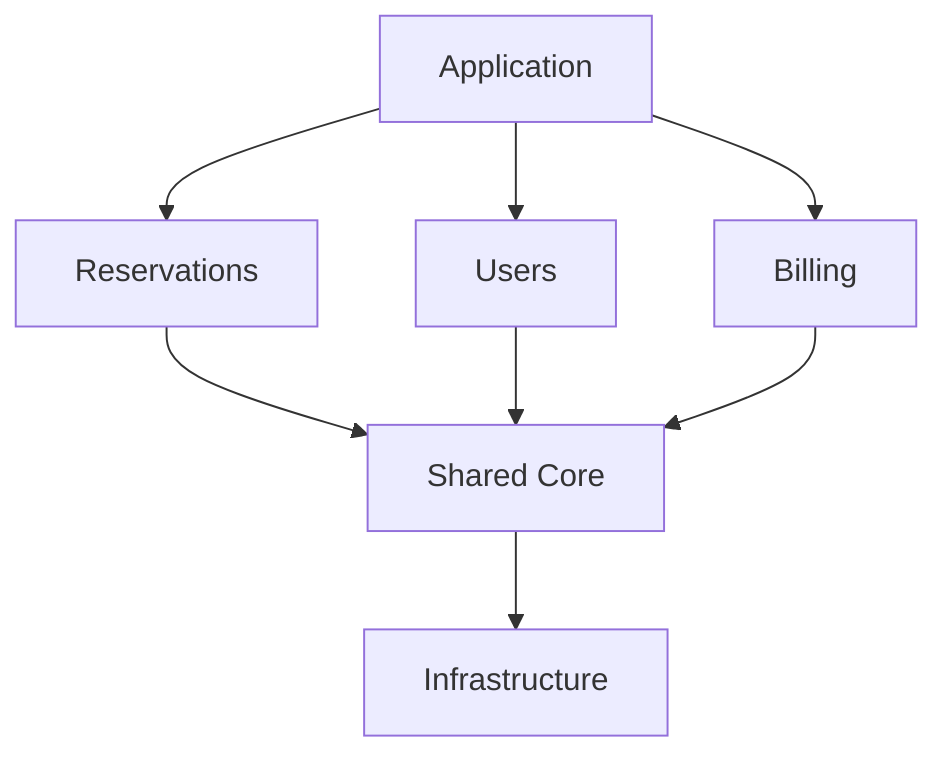
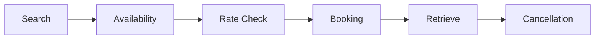
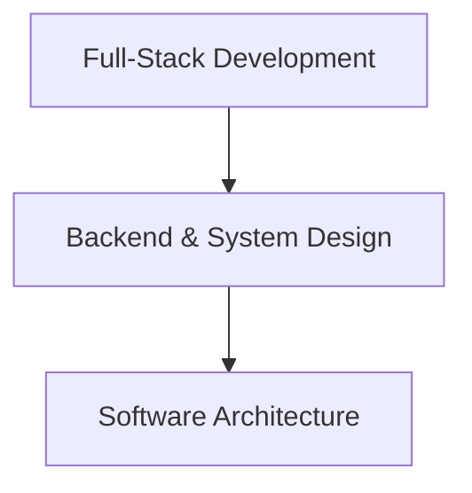

<div align="center">


<br/><br/>

<a href="https://github.com/CrixxCode">
  
</a>
<a href="https://www.linkedin.com/in/cristian-daniel-ramirez-vega-17783a3b9/">
  
</a>
<a href="https://www.instagram.com/crixxcode/">
  
</a>

<br/><br/>


</div>

<br/>

```text
> whoami
```

## `01` About Me

I'm a **Full-Stack Developer** and final-semester **Systems Engineering** student from Colombia, currently working professionally with **.NET and React**.

My strongest experience is with **Django, Django REST Framework and Angular**, which I've used to build full-stack applications involving authentication, authorization, business workflows, relational databases and REST APIs.

I'm currently expanding my experience within the **.NET ecosystem**, working with **ASP.NET Core, Entity Framework Core, Identity and Swagger**, while strengthening my knowledge of **software architecture and system design**.

I enjoy working across the entire application stack, but I'm especially interested in what happens beyond the interface: **API design, modularity, data modeling, authentication and the architectural decisions that allow software to evolve without becoming difficult to maintain**.

<div align="center">



</div>

<br/>

## `02` Current Professional Stack

<p align="center">
  <strong><code>CURRENT / PROFESSIONAL</code></strong>
</p>

<div align="center">


</div>

<br/>

I'm currently gaining professional experience developing applications with **.NET + React**, working across backend development, frontend integration, persistence, business logic and external API integrations.

<br/>

## `03` Tech Stack

<p align="center">
  <strong><code>CORE / STRONGEST EXPERIENCE</code></strong>
</p>

<div align="center">


</div>

<br/>

<p align="center">
  <strong><code>CURRENT / EXPANDING PROFESSIONALLY</code></strong>
</p>

<div align="center">


</div>

<br/>

<p align="center">
  <strong><code>DATABASES</code></strong>
</p>

<div align="center">


</div>

<br/>

<p align="center">
  <strong><code>TOOLS</code></strong>
</p>

<div align="center">


</div>

<br/>

## `04` Engineering

<p align="center">
  <strong><code>ENGINEERING INTERESTS</code></strong>
</p>

<div align="center">

| | |
|---|---|
| REST API Design | Software Architecture |
| Authentication | System Design |
| Authorization / RBAC | SaaS Architecture |
| Multitenancy | Database Design |
| API Integration | Modular Monoliths |

</div>

I'm especially interested in understanding how architectural decisions affect **maintainability, modularity, scalability and long-term software evolution**.

<br/>

<p align="center">
  <strong><code>CURRENT ARCHITECTURAL FOCUS</code></strong>
</p>

<h3 align="center">Modular Monolith</h3>

<div align="center">



</div>

I'm currently applying and studying **Modular Monolith Architecture**, focusing on clear module boundaries, separation of responsibilities and controlled complexity while retaining the operational simplicity of a single deployable application.

<br/>

## `05` Featured Project

<div align="center">

<h3>🏨 WAYRA</h3>

<strong>Hotel Management Platform</strong>

</div>

<br/>

**Wayra** is a web platform designed to centralize hotel information and operational processes.

The project combines my **academic work in Systems Engineering** with practical software development and has allowed me to work on real-world hotel-management requirements.

<!-- TODO: add a screenshot or short GIF of the WAYRA dashboard/reservation flow here — a visual beats badges for recruiters skimming the profile -->

<br/>

<p align="center">
  <strong><code>DOMAIN</code></strong>
</p>

<div align="center">

| | |
|---|---|
| Reservations | Rooms & Availability |
| Guests | Services |
| Customers | Payments |
| Billing Records | Reports |
| Users & Permissions | Notifications |
| Hotel Configuration | |

</div>

<br/>

<p align="center">
  <strong><code>ENGINEERING</code></strong>
</p>

<div align="center">


</div>

<br/>

<div align="center">

<a href="https://github.com/CrixxCode/wayra-gh">
  
</a>

</div>

<br/>

## `06` Professional Experience

I currently work as a **Full-Stack Developer Jr**, contributing across frontend and backend development.

My professional experience includes:

<div align="center">

| | |
|---|---|
| Backend APIs | Frontend Applications |
| Business Logic | Relational Databases |
| Authentication | Authorization |
| Multitenancy | SaaS Platforms |
| External API Integrations | Hotel & Reservation Systems |

</div>

<br/>

<div align="center">

<h3>Expedia Rapid API</h3>

<strong>Third-Party Lodging Integration</strong>

</div>

<br/>

I've worked with the **Expedia Rapid Lodging API**, implementing and testing hotel reservation flows involving:

<div align="center">



</div>

This experience has allowed me to work with **external business rules, third-party integrations and real-world reservation workflows**.

> Professional repositories and proprietary source code are intentionally kept private.

<br/>

## `07` Current Focus

<p align="center">
  <strong><code>NOW / LEARNING & BUILDING</code></strong>
</p>

<div align="center">


</div>

<br/>

I'm currently focused on understanding how applications can remain **maintainable, modular and adaptable as their business and technical complexity increases**.

<br/>

## `08` Achievements

<div align="center">

### 🏆 University Hackathon Winner
Maratón de Programación · 2023
Organizado por el programa de Ingeniería de Sistemas de la Universidad de La Guajira

### 🚀 Top 10 — National Hackathon
Hackathon Colombia 5.0 · 2026

</div>

<br/>

These experiences have strengthened my ability to **solve problems, work collaboratively under time constraints and transform ideas into functional software**.

<br/>

## `09` Education & Roadmap

<p align="center">
  <strong><code>WHERE I'M HEADING</code></strong>
</p>

I'm currently completing my **Systems Engineering degree**.

My goal is to continue growing as a **Full-Stack Software Developer**, strengthening both frontend and backend skills while progressively specializing in **Software Architecture**.

After finishing my undergraduate degree, I plan to pursue postgraduate studies, with particular interest in a **Master's degree in Software Architecture**.

<div align="center">



</div>

<br/>

## `10` Languages

<div align="center">

```text
Spanish    ██████████  Native
English    ████████░░  B2
```

</div>

<br/>

## `11` GitHub Stats

<div align="center">


<br/>


<br/>


</div>

<br/>

## `12` Let's Connect

<div align="center">

<a href="https://www.linkedin.com/in/cristian-daniel-ramirez-vega-17783a3b9/">
  
</a>

<a href="https://github.com/CrixxCode">
  
</a>

<a href="mailto:cristiandanrave@gmail.com">
  
</a>

<br/><br/>

```text
CODE  ·  ARCHITECTURE  ·  SYSTEMS
```

<i>Always learning. Always building.</i>

<br/><br/>


</div>
